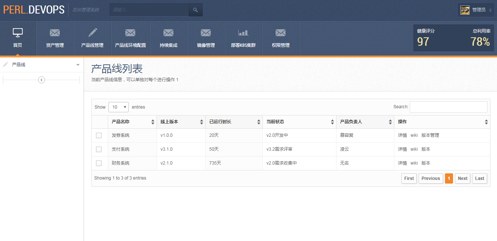
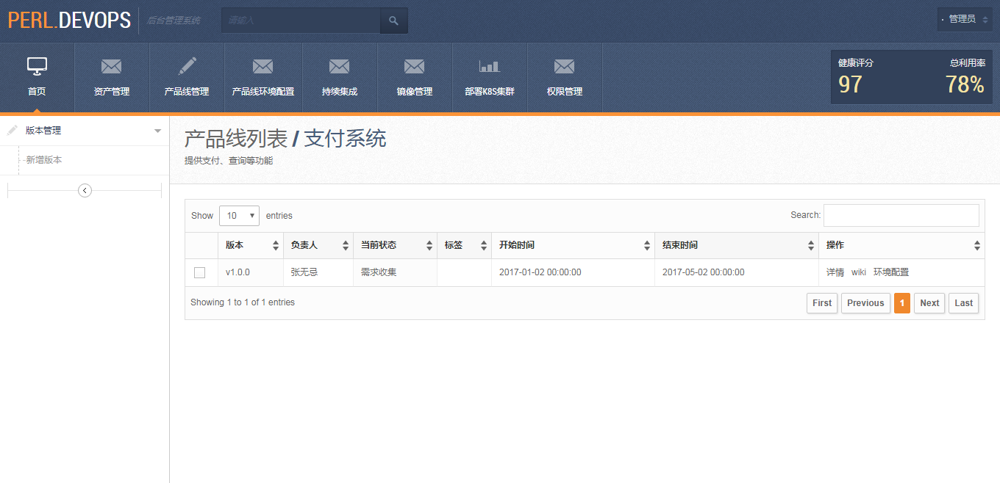
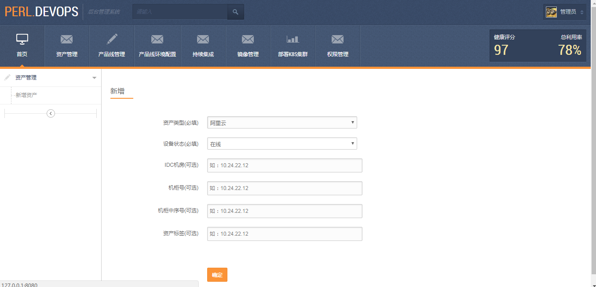
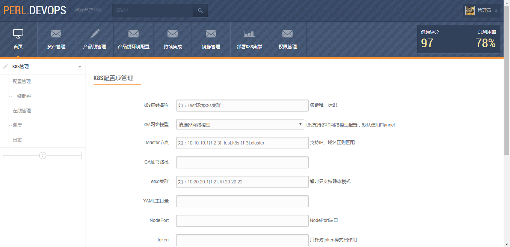

# perl-devops







### 安装PostgreSQL
```shell
$ wget https://download.postgresql.org/pub/repos/yum/10/redhat/rhel-7-x86_64/pgdg-centos10-10-2.noarch.rpm
$ rpm -ivh pgdg-centos10-10-2.noarch.rpm
$ yum install -y postgresql10-server postgresql10-contrib postgresql-devel

$ vim /etc/profile
  export POSTGRES_HOME=/usr/pgsql-10
$ source /etc/profile

$ mkdir /usr/pgsql-10/include

#支持远程客户端连接
$ vim /var/lib/pgsql/10/data/postgresql.conf
listen_addresses = '*'
#添加策略
$ vim /var/lib/pgsql/10/data/pg_hba.conf
host    all             all             远程ip/24       md5

$ systemctl restart postgresql-10.service
$ systemctl enable postgresql-10.service

#初始化数据库
$ cd /usr/pgsql-10/bin/
$ ./postgresql-10-setup initdb

$ su - postgres
psql
postgres=# alter user postgres with password '123456';
```

### 安装Perl依赖
```perl
$ sudo yum -y install perl-CPAN
$ curl -L https://cpanmin.us | perl - -M https://cpan.metacpan.org -n Mojolicious Mojo::Pg Minion Digest::MD5 Expect Compress::Raw::Zlib

$ morbo -l http://*:8080 -w ./ script/perl_dev_ops
```


### Kubernetes集群
```perl
建议部署两个集群：
一个用于生产环境(pro)
一个用于测试环境，如果有多个测试环境，如dev、test、uat，可通过namespace实现
```

#### #mojo 
https://kiwiirc.com/nextclient/#irc://irc.freenode.net/mojo?nick=guest-?
#### #history
https://freenode.logbot.info/mojo/20180925


#### 说明

##### static/kubelet
该目录中的文件会传输到各个master节点，用来配置自启动kubelet服务

##### static/ca
该目录中的文件用来生成各个组件的ca凭证

##### static/pki 
该目录中的文件用来生成各个组件的pki

##### static/manifests
该目录中的文件是各个组件的yaml配置文件

##### static/encryption
该目录中的文件是秘钥配置

##### static/audit
该目录中的文件是policy配置

##### static/conf
该目录中的文件是用来配置etcd和haproxy


程序会自动下载以下工具包到/root/perl-devops/tmp临时目录
```perl
https://download.docker.com/linux/centos/7/x86_64/stable/Packages/docker-ce-17.03.3.ce-1.el7.x86_64.rpm (docker-ce.rpm)

https://download.docker.com/linux/centos/7/x86_64/stable/Packages/docker-ce-selinux-17.03.3.ce-1.el7.noarch.rpm (docker-ce-selinux.rpm)  

https://storage.googleapis.com/kubernetes-release/release/v1.11.0/bin/linux/amd64/kubelet
https://storage.googleapis.com/kubernetes-release/release/v1.11.0/bin/linux/amd64/kubectl

https://github.com/containernetworking/plugins/releases/download/v0.7.1/cni-plugins-amd64-v0.7.1.tgz 

https://pkg.cfssl.org/R1.2/cfssl_linux-amd64 (cfssl)
https://pkg.cfssl.org/R1.2/cfssljson_linux-amd64 (cfssljson)

git clone https://github.com/kairen/k8s-manual-files.git ~/k8s-manual-files
```

#### 生成的部分文件完整性检查
```perl
[/etc/etcd/ssl]		[etcd-ca-key.pem	etcd-ca.pem	etcd-key.pem	etcd.pem]
[/etc/kubernetes/pki]	[ca-key.pem	ca.pem]
[/etc/kubernetes/pki]	[apiserver-key.pem	apiserver.pem]
[/etc/kubernetes/pki]	[front-proxy-ca-key.pem	front-proxy-ca.pem]
[/etc/kubernetes/pki]	[front-proxy-client-key.pem	front-proxy-client.pem]
[/etc/kubernetes/pki]	[controller-manager-key.pem	controller-manager.pem]
[/etc/kubernetes/pki]	[scheduler-key.pem	scheduler.pem]
[/etc/kubernetes/pki]	[admin-key.pem	admin.pem]
[/etc/kubernetes/pki]	[kubelet-k8s-11.11.11.111-key.pem	kubelet-k8s-11.11.11.111.pem]
[/etc/kubernetes/pki]	[kubelet-k8s-11.11.11.112-key.pem	kubelet-k8s-11.11.11.112.pem]
[/etc/kubernetes/pki]	[kubelet-k8s-11.11.11.113-key.pem	kubelet-k8s-11.11.11.113.pem]
[/etc/kubernetes/pki]	[sa.key	sa.pub]
```

